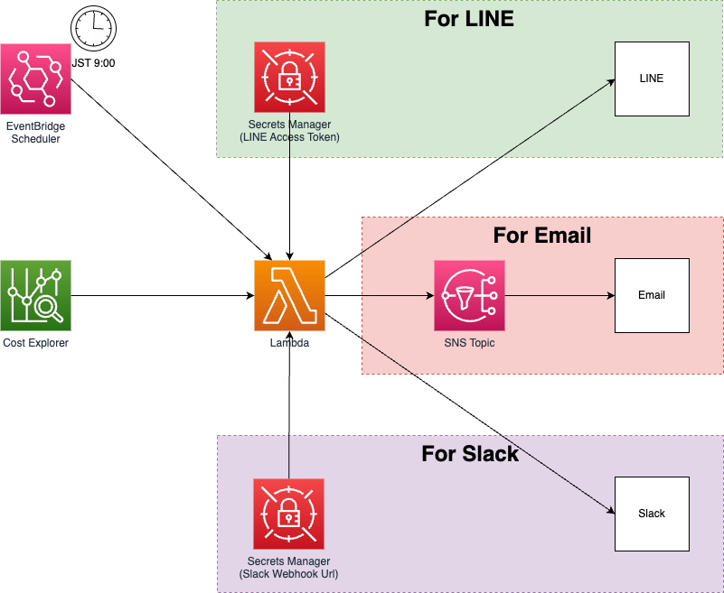

# sam-notify-aws-billing

## Overview

This system will notify you of the AWS billing amount via Email, Slack, or LINE in the following message format.

- Title

```md
AWS Billing Notification (mm/dd～mm/dd) : <Total Cost> USD
```

- Message

```
・<Service Name>: <Service Cost> USD
・<Service Name>: <Service Cost> USD
...
```

## Diagram



## Deployment

1. (If you want to notify via Slack) Obtain the webhook URL by referring to the following.

- [Sending messages using incoming webhooks \| Slack](https://api.slack.com/messaging/webhooks)

2. (If you want to notify via LINE) Obtain a Perspnal Access Token by referring to the following.

- [Help Center \| LINE Notify](https://help2.line.me/line_notify/web/?lang=en)

3. Clone this repository.

``` bash
git clone https://github.com/tsukuboshi/sam-notify-aws-billing.git
cd sam-notify-aws-billing
```

4. Build the SAM application.

``` bash
sam build
```

5. Deploy the SAM application.

- For Email

``` bash
sam deploy --parameter-overrides \
  EmailAddress=<Address>
```

- For Slack

``` bash
sam deploy --parameter-overrides \
  SlackWebhookUrl=<WebHookURL>
```

- For LINE

``` bash
sam deploy --parameter-overrides \
  LineAccessToken=<AccessToken>
```

6. (If you want to notify via LINE) Approve the email subscription to the SNS topic refer to the following.

- [Step 3: Confirm the subscription \- Amazon Simple Notification Service](https://docs.aws.amazon.com/sns/latest/dg/SendMessageToHttp.confirm.html)
